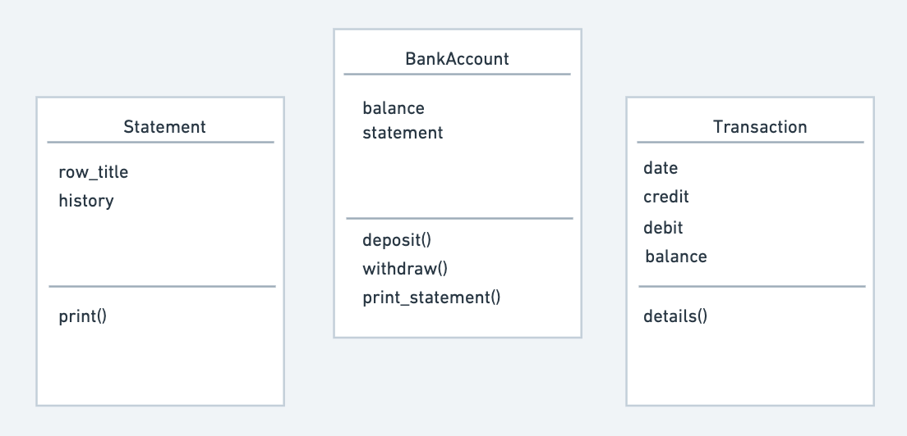
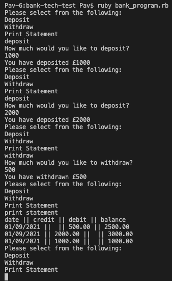

# Bank tech test

This test was given on week 10 of Makers. Essentially, it's a command-line app that enables a user to deposit and withdraw money from a bank account, and print a bank statement, detailing their transactions.

## Specification

### Requirements

- You should be able to interact with your code via a REPL like IRB or the JavaScript console. (You don't need to implement a command line interface that takes input from STDIN.)
- Deposits, withdrawal.
- Account statement (date, amount, balance) printing.
- Data can be kept in memory (it doesn't need to be stored to a database or anything).

### Acceptance criteria

**Given** a client makes a deposit of 1000 on 10-01-2012  
**And** a deposit of 2000 on 13-01-2012  
**And** a withdrawal of 500 on 14-01-2012  
**When** she prints her bank statement  
**Then** she would see

```
date || credit || debit || balance
14/01/2012 || || 500.00 || 2500.00
13/01/2012 || 2000.00 || || 3000.00
10/01/2012 || 1000.00 || || 1000.00
```

## Approach

- I decided to write my solution in Ruby and test in RSpec.
- I used Rubocop for my linter and SimpleCov to ensure good test coverage.
- I started with a BankAccount class, getting deposit and withdraw functionality working. I then moved on to the statement, getting the most current one at the top.
- I then moved on to the user interaction via the command line.
- I initially just used one class, which is on the "single_class" branch, but later used multiple classes.
- I also, initially, had the statement history as a string, but changed to an array. This will make it easier to extend functionality to include selected specific transactions.

## User stories

```
As a customer
so that I can store money at the bank
I'd like to deposit money and see my balance increase by that amount.
```

```
As a customer
so that I can take money out of the bank
I'd like to withdraw money and see my balance decrease by that amount.
```

```
As a customer
so that I can know what money has been going in and out of my account
I'd like to print a bank statement that shows the date and amount each time I deposit or withdraw money, as well as the balance.
```

## Domain model

Initially I used just one class and the following domain model.

|   BankAccount    |
| :--------------: |
|       date       |
|      credit      |
|      debit       |
|     balance      |
| ---------------- |
|     credit()     |
|     debit()      |
|   statement()    |

I then split the class up, using the following domain model:



## Running the program

First clone the repo onto your local machine:

```
git clone https://github.com/pav0107/bank-tech-test.git
```

Next, install the required gems:

```
bundle install
```

If you get a message about your bundler, please update:

```
gem install bundler
bundle install
```

Then, run the following:

```
ruby bank_program.rb
```

You'll then be asked the following:

```
Please select from the following:
Deposit
Withdraw
Print Statement
```

- The three options can be written in any combination of upper and lowercase, but misspellings or other words will bring up the options again.

- If depositing or withdrawing, you'll be asked how much and then receive a confirmation, followed by the three initial options. If zero or any non-integer is entered an error message will appear.

- If printing a statement, the statement will appear, followed by the initial three options.

## Example of the program



## Running tests

```
rspec
```

### Checking test coverage

There is 100% test coverage:

```
open coverage/index.html
```

### Running the linter

```
rubocop
```
